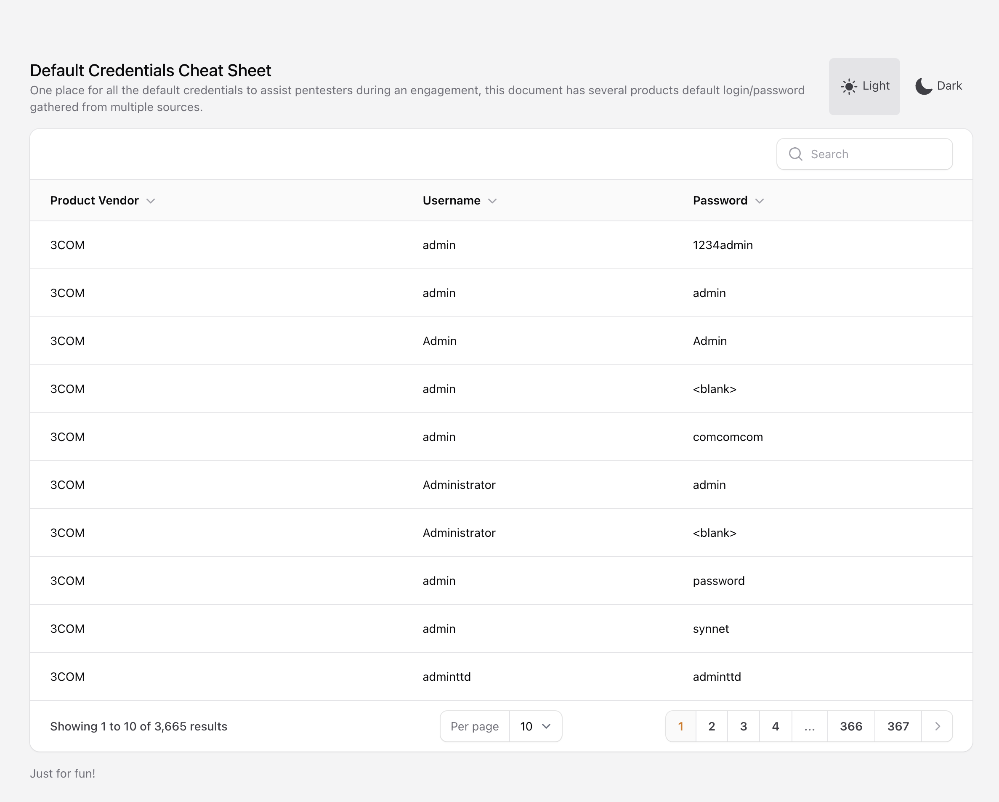

# Default Credentials Cheat Sheet

One place for all the default credentials to assist pentesters during an engagement, this document has several products
default login/password gathered from multiple sources.

Data From: https://github.com/ihebski/DefaultCreds-cheat-sheet

## Filament Tables with Livewire: Full Page Component!

- This is a demo of the Filament Tables package with Livewire.
- The table is built using the Table Builder and the data is fetched using Livewire.
- The theme is toggled using local storage and the table is responsive.

Docs: https://filamentphp.com/docs/3.x/tables/installation

### Steps to run the project
- Clone the repository
- `cp .env.example .env`
- `composer install`
- `touch database/database.sqlite`
- `php artisan key:generate`
- `php artisan migrate:fresh --seed`
- `php artisan serve`

### Screenshot

## License

The project is open-sourced software licensed under the [MIT license](https://opensource.org/licenses/MIT).
